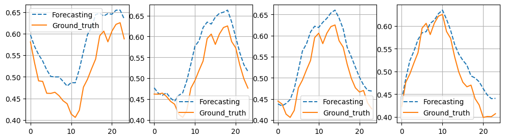

# TS_library

####  **_Description_** 
TS_library 

####  _**author**_ 
Chenghan Li,Mingchen Li,Yipu Liao,Ruisheng Diao(ZJU-UIUC)

####  **_Results_** 

 **Autoformer--MSE:0.0030 MAE:0.0416** 

**ConvTS--MSE:0.0027 MAE:0.0391** 

**Dlinear--MSE:0.0030 MAE:0.0415** 

**FEDformer--MSE:0.0045 MAE:0.0528** 

**FiLM--MSE:0.0026 MAE:0.0385** 

**LSTNet--MSE:0.0026 MAE:0.0382** 