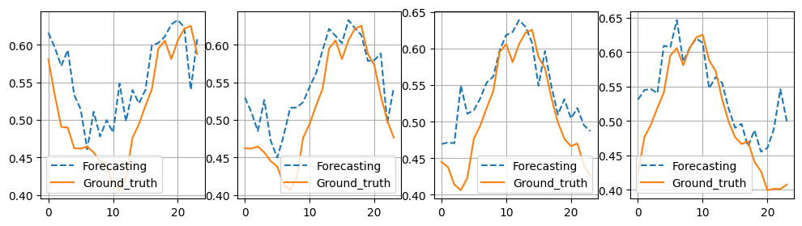
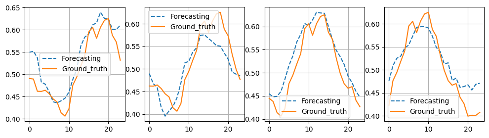

# TS_library

####  **_Description_** 
TS_library contains for 13 baselines models for time series forecasting (Autoformer(2022),ConvTS(our),Dlinear(2023),FEDformer(2022),FiLM(2023),
LSTNet(2021),MICN(2023),TiDE(2023),TimesNet(2023),informer(2021),PatchTST(2023),Transformer(2020))

####  _**author**_ 
Chenghan Li,Mingchen Li,Yipu Liao,Ruisheng Diao(ZJU-UIUC)

####  **_Results_** 

 **Autoformer--MSE:0.0030 MAE:0.0416** 

**ConvTS--MSE:0.0027 MAE:0.0391** 

**Dlinear--MSE:0.0030 MAE:0.0415** 

**FEDformer--MSE:0.0045 MAE:0.0528** 

**FiLM--MSE:0.0026 MAE:0.0385** 

**LSTNet--MSE:0.0026 MAE:0.0382** 

**MICN--MSE:0.0032 MAE:0.0435**

**TiDE--MSE:0.0034 MAE:0.0446**

**TimesNet--MSE:0.0035 MAE:0.0463**

**PatchTST--MSE:0.0.0023 MAE:0.0357**